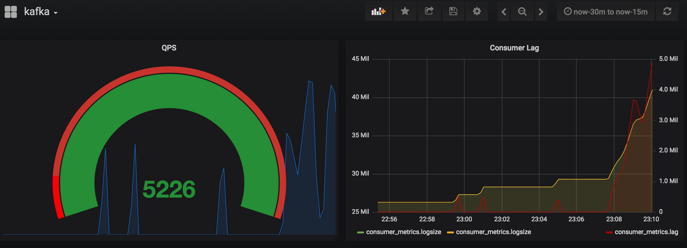
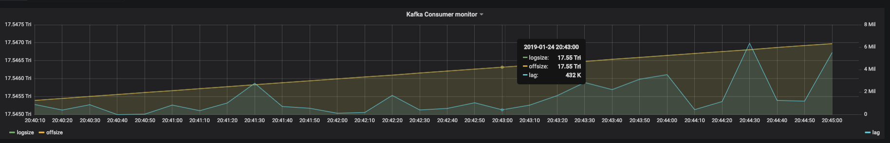

#### DemoView





````

##### Docker

A Docker file is available which builds this project on top of an Alpine Linux image.

1. Create your desired configuration files (server.yaml, logging.xml)
1. Run `docker build -t burrowx .`  It will include the server.yaml and logging.xml and automatically start service.
1. Run the container on your favourite container platform


#### Test the data

 - Create a new test topic

	```
	    bin/kafka-topics.sh --create  --zookeeper localhost:2181 --replication-factor 1 --partitions 8 --topic test_burrowx_topic
	```

 - Produce the data to the topic

	```
		for i in `seq 1 10000`;do echo "33" |  bin/kafka-console-producer.sh   --topic test_burrowx_topic --broker-list localhost:9092 ; sleep 1; done
	```

 - Create a consumer to consume the data

 	`$ pip install kafka`


		from kafka import KafkaConsumer
		consumer = KafkaConsumer('test_burrowx_topic', group_id='my_group2')
		for msg in consumer:
			print(msg)

		print("end")

 Then you will find the data in the influxdb database `burrowx` .


#### Schema in influxdb

* `cluster` : cluster name
* `topic` :  topic name
* `consumer_group` : group name
* `partition` : partition id
* `logsize` : partition logsize
* `offsize` : partition consumer offsize
* `lag` : partition consumer log


#### Query Example

````

SELECT sum("logsize") FROM "consumer_metrics" WHERE ("cluster" = 'your_cluster' AND "topic" = 'your_topic' AND "consumer_group" = 'your_consumer') AND $timeFilter GROUP BY time(10s)

SELECT sum("offsize") FROM "consumer_metrics" WHERE ("cluster" = 'your_cluster' AND "topic" = 'your_topic' AND "consumer_group" = 'your_consumer') AND $timeFilter GROUP BY time(10s)

SELECT sum("lag") FROM "consumer_metrics" WHERE ("cluster" = 'your_cluster' AND "topic" = 'your_topic' AND "consumer_group" = 'your_consumer') AND $timeFilter GROUP BY time(10s)

```

#### Features
 - Light weight and extremely simple to use, metrics are stored in [influxdb](https://github.com/influxdata/influxdb),  and could be easily viewed on [grafana](https://github.com/grafana/grafana)
 - Only support kafka version >= 0.9.X, which stores the consumer offsets in the topic `__consumer_offsets`,if you are using kafka 0.8.X, try my previous repo `https://github.com/shunfei/Dcmonitor`
```
